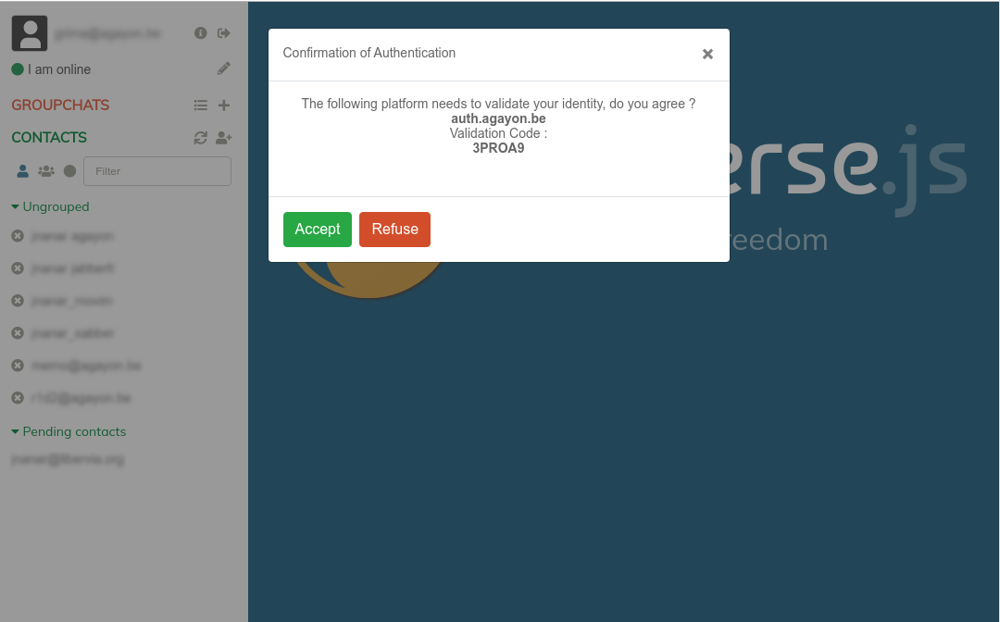

# HTTP requests verification plugin for converse.js

## Overview
This plugin provides support for XEP-0070 : Verifying HTTP Requests via XMPP.
It can be used in 2 factor authentication or as a replacement of passwords.

## Install

See https://m.conversejs.org/docs/html/plugin_development.html on how to install this plugin.

## How to use

If you want to hide the authentication request of your provider, you can set the following option in your `converse.initialize` function:
 
`hidden: ['auth.example.com']`

It will work with any jid.

You can test the implementation with the following test website: https://demo.agayon.be/

More information about the protocol and how to use it in a website:

 * https://xmpp.org/extensions/xep-0070.html
 * https://blog.agayon.be/xmpp_auth_django.html

