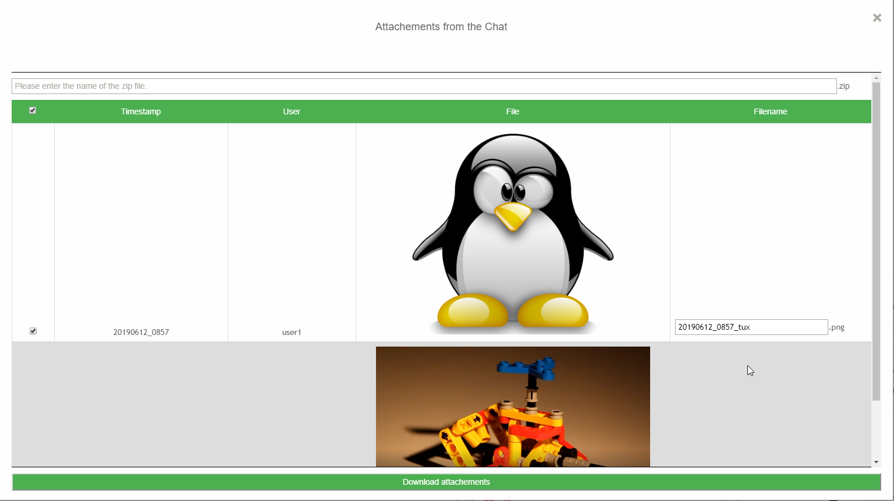

# download-dialog

A [converse.js](https://conversejs.org) plugin to download files from the chat-history.

## Overview
This Plugin adds a feature to download all files in the chat-history. The user can click on a button on the chat-toolbar to open the download-dialog. The download-dialog itself is a modal view. The user can select or deselect the files he wishes to download and set the filenames. All files fill be put into a zip-file and downloaded via the browser-dialog.

## Configuration
Which files can be downloaded will be determined by the _show_images_inline_-parameter.

## Install
See https://conversejs.org/docs/html/plugin_development.html on how to install this plugin.

## Development
The plugin uses webpack. All the code for the plugin can be found in `src/download-dialog.js`. The styles can be found in `src/download_dialog.scss`. To Build the plugin first run `npm install` and then `npx webpack`. This creates the new version of the plugin. The plugin can be found under `dist/download-dialog.js`.
